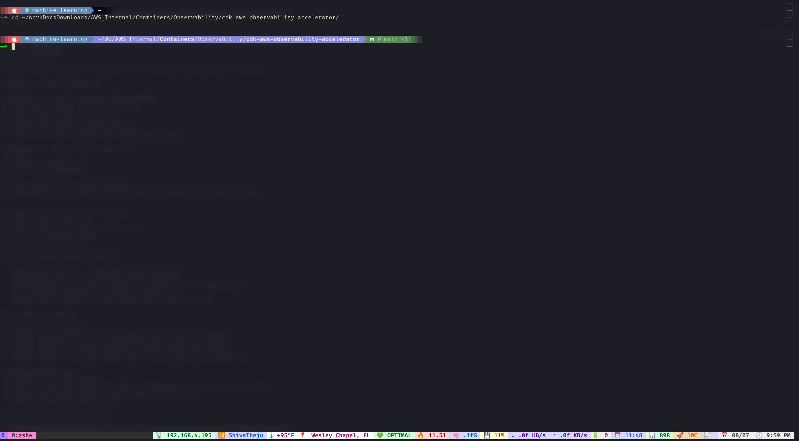

# 🚀 Terminal Configurations



## 🔥 Want Your Terminal to Look This Stunning?

**Dude, if you want your terminal to look absolutely gorgeous like this** - with that beautiful lavender prompt, real-time system monitoring, auto-location detection, and those sweet pastel colors - you're in the right place! 

This isn't just another boring terminal setup. This is a **complete terminal transformation** that will make your colleagues jealous and your productivity soar. 🚀

✨ **What makes this special?**
- 🎨 **Gorgeous lavender prompt** that changes colors based on your project
- 🌡️ **Auto-location & weather** - your terminal knows where you are!
- 📊 **Real-time system monitoring** - CPU, memory, network speeds, all beautifully displayed
- 🎯 **Smart directory colors** - special themes for AWS projects
- ⚡ **Lightning fast** - optimized for performance, not just looks

**Ready to transform your terminal?** Just run the install script below and watch the magic happen! ⬇️

---

Beautiful, functional terminal setup with Zsh, Powerlevel10k, and Tmux configurations.

## 📋 What's Included

- **Zsh Configuration** - Custom `.zshrc` with optimizations
- **Powerlevel10k Theme** - Beautiful prompt with custom colors and segments
- **Tmux Configuration** - Custom status bar with system monitoring
- **Custom Scripts** - Temperature and location detection scripts
- **Installation Scripts** - Automated setup for new machines

## 🎨 Features

### Powerlevel10k Prompt
- **AWS Observability Project**: Special gorgeous lavender background with navy text
- **Git Integration**: Branch status and statistics
- **System Information**: OS icon, Kubernetes context
- **Clean Design**: Two-line prompt with custom colors

### Tmux Status Bar
- **Network Info**: IP address and WiFi network name
- **Location & Weather**: Auto-detected location and current temperature
- **System Monitoring**: CPU, memory, disk usage, battery
- **Network Activity**: Real-time upload/download speeds
- **Process Info**: Running processes and CPU cores
- **Time & Date**: Current time and date display

### Custom Features
- **Auto-location Detection**: Temperature and location based on current IP
- **Soft Pastel Colors**: Beautiful color scheme throughout
- **System Health**: Visual indicators for system status
- **Network Monitoring**: Real-time network statistics

## 🛠️ Quick Setup (New Machine)

```bash
# 1. Clone this repository
git clone https://github.com/elamaran11/terminal-configurations.git
cd terminal-configurations

# 2. Run the installation script
chmod +x install.sh
./install.sh

# 3. Restart your terminal or source the configs
source ~/.zshrc
```

## 📁 Directory Structure

```
terminal-configurations/
├── zsh/
│   └── .zshrc                 # Zsh configuration
├── p10k/
│   └── .p10k.zsh             # Powerlevel10k theme configuration
├── tmux/
│   └── tmux.conf             # Tmux configuration
├── scripts/
│   ├── get_temp.sh           # Temperature detection script
│   └── get_location.sh       # Location detection script
├── backup-configs/           # Original config backups
├── install.sh               # Automated installation script
└── README.md               # This file
```

## 🔧 Manual Installation

If you prefer manual setup:

### 1. Install Dependencies
```bash
# Install Homebrew (if not installed)
/bin/bash -c "$(curl -fsSL https://raw.githubusercontent.com/Homebrew/install/HEAD/install.sh)"

# Install required packages
brew install zsh tmux ifstat
brew install --cask font-meslo-lg-nerd-font

# Install Oh My Zsh
sh -c "$(curl -fsSL https://raw.github.com/ohmyzsh/ohmyzsh/master/tools/install.sh)"

# Install Powerlevel10k
git clone --depth=1 https://github.com/romkatv/powerlevel10k.git ${ZSH_CUSTOM:-$HOME/.oh-my-zsh/custom}/themes/powerlevel10k
```

### 2. Copy Configurations
```bash
# Copy configuration files
cp zsh/.zshrc ~/.zshrc
cp p10k/.p10k.zsh ~/.p10k.zsh
cp tmux/tmux.conf ~/.config/tmux/tmux.conf

# Copy and setup scripts
mkdir -p ~/.local/bin
cp scripts/* ~/.local/bin/
chmod +x ~/.local/bin/*.sh
```

### 3. Setup Tmux Plugin Manager
```bash
git clone https://github.com/tmux-plugins/tpm ~/.local/share/tmux/plugins/tpm
```

## 🎯 Key Features Explained

### Directory Colors
- **AWS Observability Project**: When in the `cdk-aws-observability-accelerator` directory, the path displays with a gorgeous lavender background and navy text

### Tmux Footer Order
1. 📡 IP Address
2. 📶 WiFi Network Name  
3. 🌡️ Current Temperature
4. 📍 Current Location
5. 💚 System Health
6. 🔥 CPU Load
7. 🧠 Memory Usage
8. 💾 Disk Usage
9. ⇣⇡ Network Speed
10. 🔋 Battery
11. ⏰ System Uptime
12. 📊 Process Count
13. 🚀 CPU Cores
14. 📈 CPU Usage %
15. 📅 Date
16. 🕘 Time

### Auto-Detection Features
- **Temperature**: Automatically detects current temperature based on IP location
- **Location**: Shows current city and state
- **WiFi Network**: Displays current WiFi network name
- **System Stats**: Real-time system monitoring

## 🔄 Updating Configurations

To save new changes to the repository:

```bash
cd ~/terminal-configurations
./backup-current.sh  # Backup current configs
git add .
git commit -m "Update terminal configurations"
git push origin main
```

## 🎨 Customization

### Colors
- Tmux uses soft pastel colors for each segment
- P10k uses gorgeous lavender with navy text for special directories
- All colors are easily customizable in the config files

### Adding New Features
- Edit `tmux/tmux.conf` for tmux customizations
- Edit `p10k/.p10k.zsh` for prompt customizations
- Add new scripts to `scripts/` directory

## 📝 Notes

- Configurations are optimized for macOS
- Requires Nerd Font for proper icon display
- Auto-location features require internet connection
- All scripts include fallback values for offline use

## 🤝 Contributing

Feel free to fork and customize for your own use!

---

**Enjoy your beautiful terminal setup! 🎉**
